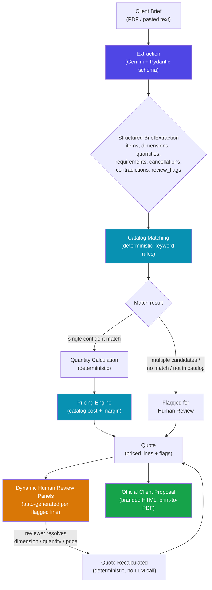

# AI Quoting Tool & Proposal Studio

AI-assisted client brief extraction, **deterministic** quoting, interactive human review, and official client-ready proposal generation for an events production company.

Built for **Munginvest**.

---

## What this tool does

A client sends a brief — usually a messy real-world email thread, RFP document, or meeting notes, full of ambiguity, contradictions, and informal language. This tool:

1. **Reads the brief** (PDF or pasted text) using an LLM (Gemini) to pull out structured observations — items, dimensions, quantities, requirements, cancellations, contradictions.
2. **Matches** each observation to a recipe/catalog code using **deterministic keyword rules** — never guessed by the LLM.
3. **Calculates quantities and prices** deterministically from the catalog (cost, margin, minimum order quantities).
4. **Flags anything genuinely ambiguous** for a human to resolve (missing dimensions, quantity ranges, custom pricing, items not in the catalog) — through a **dynamic** review UI that adapts to whatever the brief actually contains, not a fixed set of items.
5. **Generates a branded, client-ready commercial proposal** (HTML, printable to PDF) with margins broken out per line, only claiming inclusions that are actually priced in the quote.

### Core design principle: the LLM only *reads*, it never *decides*

This is the single most important architectural rule in the whole project:

> The LLM's job is limited to interpreting the brief into structured data. It never calculates prices, never resolves contradictions, never picks a catalog match with confidence, and never invents a missing number. All of that is deterministic Python code, or an explicit human decision.

This makes the tool **auditable** — the same resolved inputs always produce the same quote, and every number in a proposal can be traced back to either the client's own words or a human's explicit choice.

---

## Pipeline overview



**Key point on the loop back from J → K → I:** resolving a flagged item never calls the LLM again. It's a pure deterministic recalculation, which is what makes the review step safe, fast, and repeatable.

---

## Key features

### Extraction (`app/extractor.py`, `app/models.py`)
- Supports Gemini (default), OpenAI, and Ollama as interchangeable LLM providers.
- `temperature=0.0` pinned for maximum determinism (LLMs are not perfectly deterministic even at temp=0, but this minimizes drift).
- Structured output via a Pydantic schema (`BriefExtraction`) — no free-text parsing.
- Preserves **contradictions** explicitly (e.g. brief says 6m, then later says "at least 8m") rather than silently picking one.
- Preserves **cancellations** and links them to the original item.
- Detects **adversarial prompt injection** embedded in brief documents (e.g. a hidden instruction trying to force an unauthorized line item into the quote) and flags it as a critical security review item — it is always excluded from pricing.
- Auto-extracts `client_organization`, `event_name`, and `venue` from the brief text to pre-fill the proposal (never guessed if not stated).

### Catalog matching (`app/matcher.py`)
- Deterministic keyword-rule engine — no LLM involvement.
- **Fan-out matching**: a single brief sentence describing multiple physical products (e.g. "a stage... with steps and it must have the ramp for accessibility") correctly produces *multiple* independent catalog lines instead of forcing a single choice.
- Distinguishes genuinely independent components (ramp + stage + stairs) from a single ambiguous item matched by two unrelated rules (e.g. "LED backdrop wall" incorrectly also matching a generic print-backdrop rule) — the latter is scoped with exclusion keywords to prevent false duplicates.
- Global (non-item-specific) requirements — like "whatever crew you need" or "backup power, non-negotiable" — are matched against the catalog too, so a mandatory requirement never silently disappears just because it wasn't phrased as a per-item request.

### Quantity & pricing (`app/quantities.py`, `app/pricing.py`)
- Deterministic. Parses stated ratios from the brief text itself (e.g. "8 guests per table") rather than assuming a fixed default.
- Applies catalog minimum-order-quantities correctly.
- Multi-day billing (setup day + event day) is derived from whether the brief actually mentions an overnight setup — never hardcoded.
- A human resolution can target **one specific catalog product** within a bundled/fan-out item (via `recipe_code` scoping) so resolving one component (e.g. confirming sofa quantity) can never accidentally overwrite a sibling component (e.g. a projector count) from the same brief sentence.

### Human review (`app/resolution.py`, `app/web.py`)
- **Fully dynamic**: a resolution panel is generated for *any* line that needs a decision, for *any* brief — not a fixed set of hardcoded items. The panel type (dimension inputs, quantity range picker, custom pricing, or "cannot auto-price") is inferred from the line's own review reason and unit.
- Smart dimension presets: if the brief stated an original width×height ratio before being updated to a new width only, the tool offers "keep original ratio" as a one-click option instead of blank inputs.
- Every choice auto-applies immediately on selection (no separate "confirm" step needed), and stays visible with a confirmation badge afterwards so the reviewer can always come back and change their mind.

### Proposal generation (`app/proposal.py`)
- The "Inclusions" section is **built dynamically from what's actually priced** in the quote — it never claims something (like wheelchair ramp compliance or backup power) is included unless a corresponding line is actually in the quote.
- If a safety-relevant requirement (accessibility, backup power) was requested in the brief but never made it into a priced line, the proposal shows an explicit red warning banner instead of staying silent.
- Print-safe CSS: category sections are kept together across page breaks, and background colors are forced to print (browsers strip them by default).
- Branded with the Munginvest logo in the header plus a subtle watermark; export is via "download HTML → browser print to PDF" (Ctrl+P), which preserves exact on-screen styling without any extra PDF library dependency.

---

## Project structure

```
app/
├── extractor.py        # LLM brief extraction (Gemini/OpenAI/Ollama)
├── models.py            # Pydantic schema for extraction output
├── matcher.py            # Deterministic catalog matching (fan-out design)
├── quantities.py         # Deterministic quantity calculation
├── pricing.py            # Deterministic cost/margin pricing engine
├── quote_generator.py    # Orchestrates matching → quantities → pricing → flags
├── quote_models.py       # Pydantic schema for the priced quote
├── resolution.py          # Human resolution data model + generic builders
├── review.py               # Review flag aggregation, quote status logic
├── proposal.py             # Client-facing HTML proposal generation
├── pipeline.py              # End-to-end orchestration (extraction → quote)
├── web.py                    # Streamlit UI — upload, review, proposal
├── catalog.py                  # Recipe catalog loader
├── pdf_reader.py                # PDF text extraction
├── cli.py                        # Command-line interface (extract / quote)
└── assets/                        # Logo & branding images
data/
├── recipe_catalog.csv    # Product catalog: costs, margins, MOQs
└── client_brief.pdf       # Sample brief for testing
tests/                       # Full pytest suite (143+ tests)
```

---

## Setup

```bash
pip install -r requirements.txt
```

Set your Gemini API key (one-time, persists across terminal sessions on Windows):

```bash
setx GEMINI_API_KEY "your-key-here"
```
*(open a new terminal window after running this)*

## Running

```bash
streamlit run app/web.py
```

Or via the CLI, without the UI:

```bash
# Extract only
python -m app.cli extract data/client_brief.pdf -o output/extraction.json

# Full pipeline
python -m app.cli quote data/client_brief.pdf -o output/quote.json
```

## Testing

```bash
pytest tests/ -v
```

---

## Known limitations (honest, for future work)

- **LLM non-determinism**: even at `temperature=0.0`, Gemini can occasionally phrase or group observations slightly differently between runs on the same brief — most visible on open-ended requests without a specific number (e.g. "whatever crew you need"). The deterministic layers behave identically given identical extraction output; the extraction step itself is the only non-fully-deterministic part of the pipeline.
- **No automatic "pick one of several candidate catalog codes"** resolution flow yet — when the matcher genuinely can't disambiguate (e.g. two unrelated catalog rules both fire on one sentence), the reviewer currently must exclude the line and price it manually rather than choosing from the candidate list in the UI.
- **Capacity-only quantity specs** (e.g. "cocktail tables for ~150 guests standing", with no stated tables-per-guest ratio) don't yet have a dedicated resolution panel — they can be excluded and priced manually outside the tool.
- Commercial terms (payment terms, cancellation policy, validity period) in the proposal are placeholder boilerplate and should be reviewed against actual company policy before sending to a real client.
