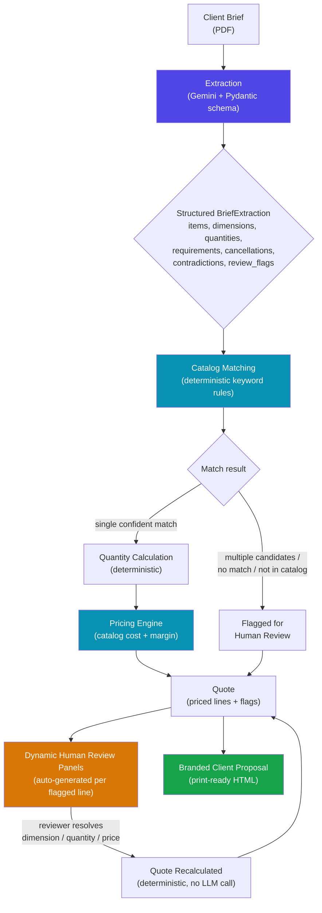

<div align="center">

# AI Quotation & Proposal Studio

**From a messy client brief to a priced, client-ready proposal — in minutes, not hours.**


</div>

---

## What This Is

A client sends a brief — usually a messy, real-world email thread, RFP document, or meeting notes: contradictions, vague quantities, informal language. This tool:

1. **Reads** the brief (PDF) with an LLM and pulls out structured data — items, dimensions, quantities, requirements, cancellations, contradictions.
2. **Matches** every item to a product/recipe using deterministic keyword rules — never guessed by the AI.
3. **Calculates & prices** everything deterministically from the catalog (cost, margin, minimum order quantities).
4. **Flags anything genuinely ambiguous** for a human, through a review UI that adapts automatically to whatever the brief contains.
5. **Generates a branded, client-ready commercial proposal**, ready to send.

### The one rule everything else is built around

> **The AI only reads. It never decides.**
> Extraction is the LLM's entire job. Every price, every match, every calculation is deterministic code — auditable, repeatable, and never hallucinated.

---

## 🤖 AI Tools Used to Build This

This project was built AI-natively — every stage of the workflow, from first scaffold to final polish, used an AI tool deliberately chosen for that stage:

| Tool | Role in this project |
|---|---|
| **[Antigravity](https://antigravity.google/)** | Early-stage scaffolding — initial architecture pass and the fan-out catalog-matching redesign, before the main build-out phase |
| **[Claude](https://claude.ai) (Anthropic)** | The primary build partner for the majority of this project — iterative debugging, root-cause diagnosis across multiple test briefs, the full dynamic human-review system, responsive/print CSS, branding integration, and this README |
| **[Google Gemini](https://ai.google.dev/)** | Not just a dev tool — this is the LLM running *inside* the shipped product, doing structured brief extraction at runtime |
| **[Whisk](https://labs.google/whisk)** | Generated the Munginvest logo assets |

Two different working modes on purpose: Gemini is a **runtime dependency** the app calls on every quote; Antigravity and Claude were **build-time collaborators** used during development and are not part of the running app.

---

## Pipeline



**The loop from J → K → I never calls the LLM again.** Resolving a flagged item is a pure deterministic recalculation — that's what makes human review fast, safe, and repeatable.

---

## ✨ Key Features

### 🧠 Extraction
- Google Gemini, structured JSON output validated against a Pydantic schema — no free-text parsing
- `temperature=0.0` + fixed seed for maximum determinism
- Preserves **contradictions** explicitly instead of silently picking one
- Detects **adversarial prompt-injection** hidden inside brief documents and blocks it from ever reaching pricing
- Auto-extracts client name, event name, and venue to pre-fill the proposal — never guessed

### 🔗 Catalog Matching
- 100% deterministic keyword-rule engine, no LLM involvement
- **Fan-out matching**: one sentence describing multiple products (e.g. "a stage with steps and a ramp") correctly produces multiple independent line items
- Global (non-item-specific) requirements — "whatever crew you need," "backup power, non-negotiable" — are matched too, so mandatory requirements never silently vanish

### 💰 Quantities & Pricing
- Parses the client's own stated ratios (e.g. "8 guests per table") instead of assuming defaults
- Correct minimum-order-quantity handling
- Multi-day billing derived from whether the brief actually mentions overnight setup

### ✅ Dynamic Human Review
- A resolution panel is generated automatically for **any** ambiguous line, on **any** brief — not a fixed set of hardcoded items
- Smart dimension presets pulled directly from the brief's own text
- Every decision stays visible and editable after being made

### 📄 Client Proposal
- The "Inclusions" section is built from what's *actually* priced — never overclaims scope
- Explicit red warning banner if a safety-relevant requirement (accessibility, backup power) was requested but never priced
- Fully responsive and print-safe CSS; branded with logo + watermark
- One click: download HTML → browser print → PDF

### 🔍 Brief Highlights
- The original brief text, auto color-coded from real extraction data — not a manual summary
- 🟢 taken literally · 🟡 needed human judgment · 🟣 global requirement confirmed used in pricing · 🔴 adversarial instruction blocked

---

## Project Structure

```
app/
├── extractor.py        # LLM brief extraction (Gemini)
├── models.py            # Pydantic schema for extraction output
├── matcher.py            # Deterministic catalog matching (fan-out design)
├── quantities.py         # Deterministic quantity calculation
├── pricing.py             # Deterministic cost/margin pricing engine
├── quote_generator.py     # Orchestrates matching → quantities → pricing → flags
├── quote_models.py         # Pydantic schema for the priced quote
├── resolution.py             # Human resolution data model + generic builders
├── review.py                  # Review flag aggregation, quote status logic
├── proposal.py                 # Client-facing HTML proposal generation
├── pipeline.py                  # End-to-end orchestration
├── web.py                        # Streamlit UI — upload, review, proposal
├── catalog.py                     # Recipe catalog loader
├── pdf_reader.py                   # PDF text extraction
├── cli.py                           # Command-line interface
└── assets/                           # Logo & branding images
data/
├── recipe_catalog.csv    # Product catalog: costs, margins, MOQs
└── client_brief.pdf       # Sample brief for testing
tests/                       # Full pytest suite (143+ tests)
```

---

## Getting Started

```bash
pip install -r requirements.txt
```

Set your Gemini API key:

```bash
setx GEMINI_API_KEY "your-key-here"   # Windows, new terminal after
export GEMINI_API_KEY="your-key-here"  # macOS/Linux
```

Run the app:

```bash
streamlit run app/web.py
```

Run the tests:

```bash
pytest tests/ -v
```

---

## Honest Limitations

- **LLM non-determinism**: even at `temperature=0.0`, Gemini can occasionally phrase or group observations differently between runs on the same brief — most visible on open-ended requests without a specific number.
- **No automatic "pick one of several candidate matches"** UI yet — when the matcher genuinely can't disambiguate, the reviewer excludes the line and prices it manually.
- **Capacity-only quantity specs** (e.g. "tables for ~150 guests standing," no stated ratio) don't yet have a dedicated resolution panel.
- Commercial terms (payment, cancellation policy) in the proposal are placeholder boilerplate — review before sending to a real client.

---

<div align="center">

Built by **[qusai9898](https://github.com/qusai9898)** — AI-native, top to bottom.

</div>
